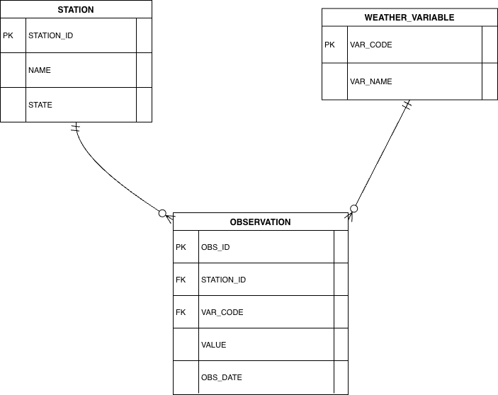
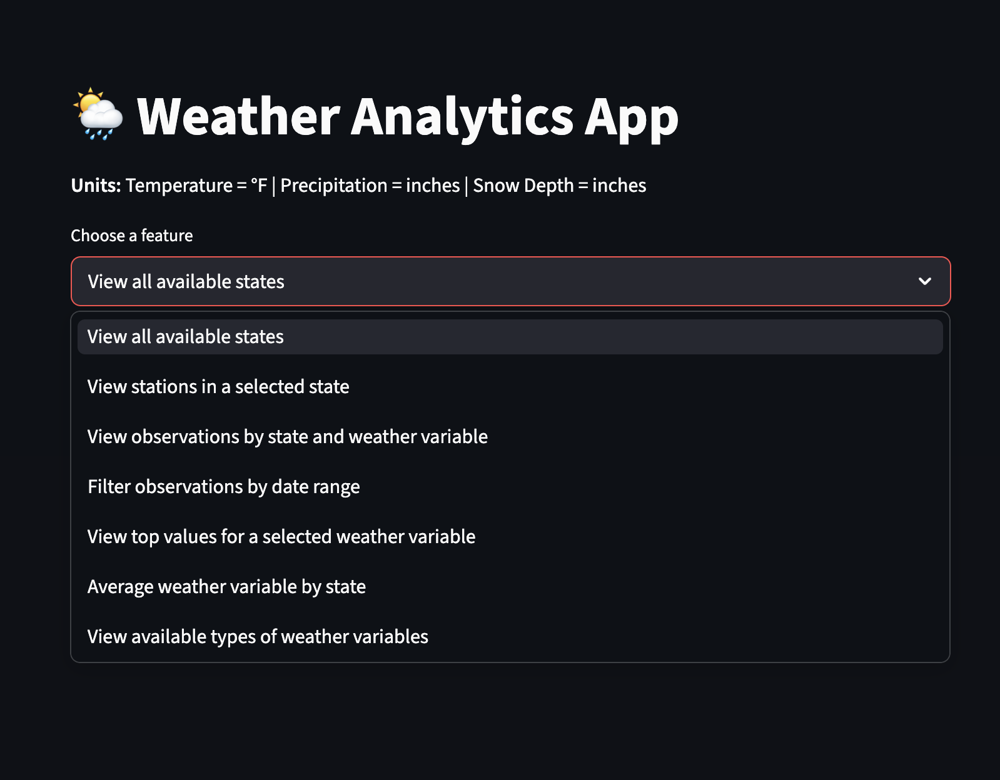

# Weather Analytics Database

## Summary
This project is a Weather Analytics Database designed to store, manage, and analyze large-scale weather data across different locations and dates. The system allows users to explore trends, compare regions, and identify extreme weather patterns using an interactive Streamlit application.

## Final ER Diagram

## STATION
- STATION (PK)
- NAME
- STATE

## WEATHER_VARIABLE
- VAR_CODE (PK)
- VAR_NAME

## OBSERVATION
- OBS_ID (PK)
- STATION_ID (FK → STATION.STATION_ID)
- OBS_DATE
- VAR_CODE (FK → WEATHER_VARIABLE.VAR_CODE)
- VALUE

## ER Diagram

## How To Use
1. Load the DB - run the following script to create and populate with real data. 
   - python3 load_sqlite.py
2. Run the Application
   - run: python3 -m streamlit run weather_app.py
3. Use the app! :)
     - View available states
     - View stations by state
     - Filter observations by date
     - View top values for selected weather variables
     - Compare average weather values across states
     - View weather variable definitions
  
## Application Preview

## Application Domain:
This database supports weather analysis, stores weather data, analyzes it over time, and identifies patterns. 

## High-Level Goals:
- Store weather observations by date and location
- Support the analysis of weather trends over time
- Identify unusual weather patterns
- Support user queries for summarized weather information

## Intended Users:
- Climate researchers
- Data analysts
- Environmental planners and engineers
- Students and educators

## Data Sources:
The database will use publicly available weather datasets from the NOAA.

## Update - Database Application (Part B)
This project designs a relational Weather and Climate Analytics databse to store and analyse daily weather observations by station and date. A subset of NOAA GHCHN-D (Global Historical Climatology Network - Daily) data from 01/01/2026 to 01/07/2026. It uses real-world observations from 3,625 unique weather stations across 10 different U.S. states. 

The schema models weather stations, weather variables, and observations.

